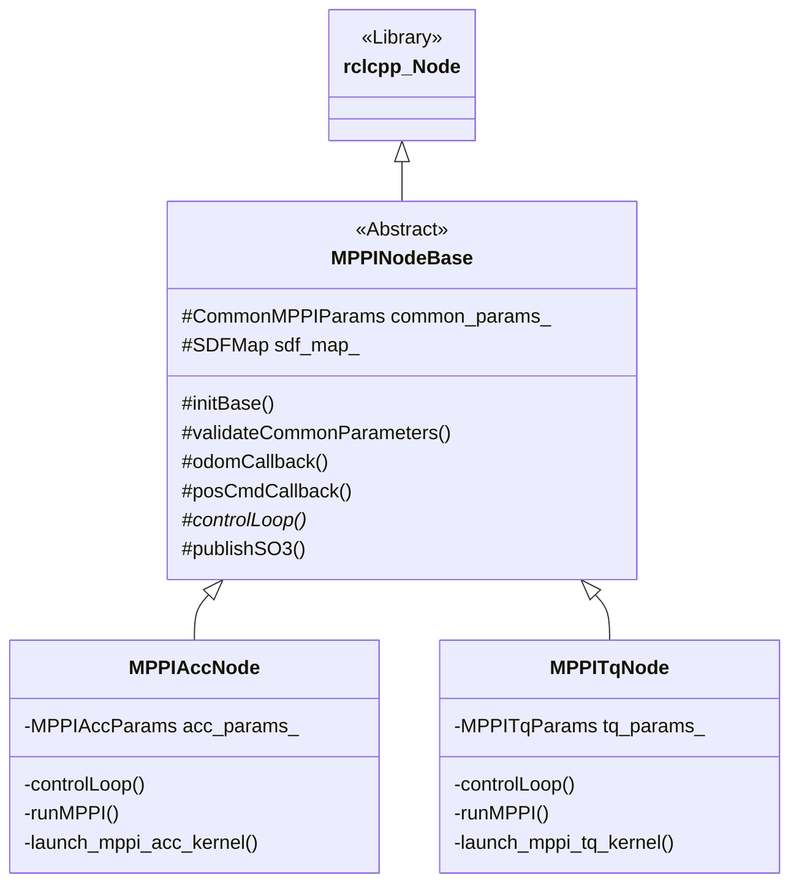

# MPPI Control Node Architecture

The MPPI (Model Predictive Path Integral) control system is designed with a modular inheritance structure to support different control strategies while sharing common ROS 2 infrastructure and environment sensing logic.

## Class Hierarchy

The implementation uses a base class `MPPINodeBase` to handle boilerplate tasks like ROS subscriptions, publishers, odometry processing, and SDF map management. Specific MPPI variants inherit from this base and implement their own control loops and CUDA kernel integrations.

## Variants

### 1. MPPI Acceleration Node (`MPPIAccNode`)
- **Control Space:** 3D Acceleration vectors.
- **Output:** Publishes optimized acceleration as part of a `PositionCommand` or converts it to an `SO3Command`.
- **Ideal for:** Higher-level planning where the low-level controller handles attitude tracking.

### 2. MPPI Thrust-Quaternion Node (`MPPITqNode`)
- **Control Space:** 5D space consisting of Thrust magnitude (1) and Orientation Quaternion (4).
- **Output:** Directly optimizes the values sent to the `SO3Command` (Thrust and Orientation).
- **Ideal for:** Aggressive maneuvers where direct control over the drone's attitude is required within the optimization horizon.

## Shared Infrastructure

- **MPPINodeBase**: Handles the lifecycle of the `SDFMap` (ESDF), subscriber callbacks for odometry and position commands, and ensures data readiness before starting the optimization loop.
- **CUDA Kernels**: Both variants use specialized CUDA kernels to perform parallel rollouts of thousands of samples, calculating costs and updating the mean control sequence according to the MPPI law.
